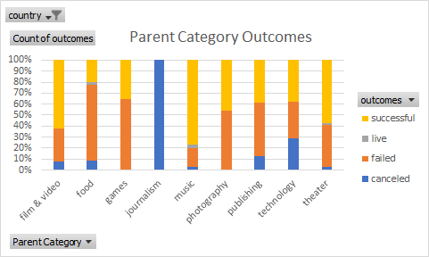
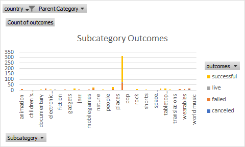
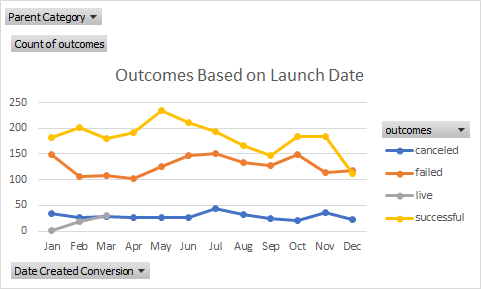

# An Analysis of Kickstarter Campaigns
Performing analysis on Kickstarter data to uncover trends
---
# Parent Category Outcomes 

---
# Subcategory Outcomes

---
# Outcomes Based on Lanch Date

---
# Recommendations/Comments
- Plays are one of the most successful crowdfunding campaign categories in the US, so you're on the right track!
- May is the best month to start a campaign. January, June, July, and October are not good times to start.
- Decreasing your goal will make your campaign more successful.
