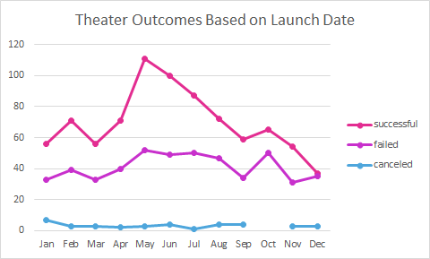
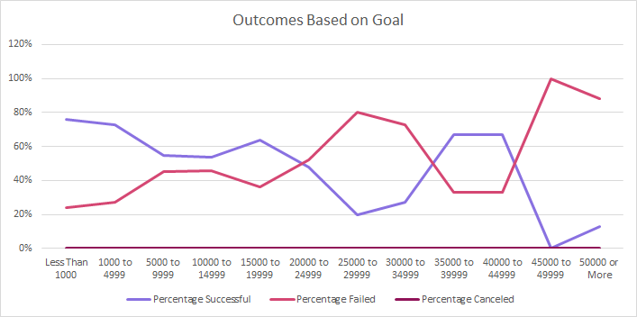

# Kickstarting with Excel

## Overview of Project
*After Louise's play came close to reaching it's goal quickly, she wanted to understand the campaign outcomes based on their launch dates and funding goals.*
### Purpose
The purpose of this analysis was to determine how different campaigns fared in relation to their launch dates and their funding goals
---

## Analysis and Challenges

### Analysis of Outcomes Based on Launch Date
1. My first step was to create a new column titles "Years" in the Kickstarter worksheet. I used the Year() function and referenced the "Date Created Conversion" column to extract the years.### Analysis of Outcomes Based on Launch Date
2. Next, I created a pivot table where I was able to use "Parent Category," "Years," and "outcomes" to create a line chart.

---
### Analysis of Outcomes Based on Goals
1. In order to create an "Outcomes Based on Goals" chart, I first needed to create a new worksheet with the same name
I added column headers, and dollar-amount ranges before performing any functions(i.e.COUNTIFS(),SUM(),ROUND()).
2. From the completed table, I was able to create the following line chart

---

### Challenges and Difficulties Encountered
1. One only challenge I had was getting the "COUNTIFS()" function to work properly. It took longer than expected. After using the, I still was unable to notice the issue. That is until I realized that I had to put the "goal" criteria before any other criteria. Once I moved around my criteria, I was able to populate the information quickly
2. Another issue I had was with getting the images to populate in GitHub. After changing the syntax a bunch of times, I reached out to the TA. The issue was that I was using syntax to extract images from my hard drive instead of uploading them to my repository first. Once I uploaded the images to my repository and updated the syntax, everything looked great!
---

## Results

### Conclusions About The Outcomes Based on Launch Date
1. Your campaign is more likely to be successful if you launch in May. 
2. By launching in December, your chances of suceeding and failing are similar.
### Conclusion About The Outcomes Based on Goals
1. You're more likely to have a successful campaign if your goal is less than $20,000.
### Limitations of This Dataset
1. One thing I noticed is that the plays aren't categorized by genre. I feel that metric would help further determine what plays audiences are most interested, and allow a playwright to take that into consideration.
2. Also, I feel that if the geographical locations were categorized by cities, it would help determine the best to crowdfund within a specific country
### Other Possible Tables and/or Graphs That We Could Create
1. Another chart we could try is campaign outcomes based on location and funding goals, since some cities/countries could be receiving more funds.
